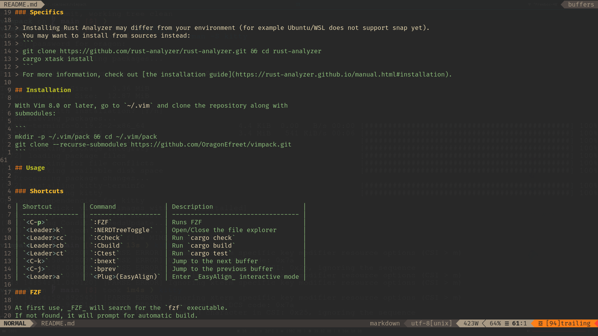

# Personal VIM environment

This repository is a vim package that holds and configures all plugins
I personnally use in vim.
I mainly use vim as a Rust IDE, which oriented my choices of plugins and
settings.



The following plugin are available:

- [ALE](https://github.com/dense-analysis/ale): Linter on top of _RLS_ (with _Rust Analyzer_)
- [FZF.vim](https://github.com/junegunn/fzf.vim): _FZF_ enhancements
- [FZF](https://github.com/junegunn/fzf): Fuzzy Finder for quick file search.
- [gruvbox](https://github.com/morhetz/gruvbox): The famous theme by Pavel Pertsev
- [NERDTree](https://github.com/preservim/nerdtree): File explorer
- [Rust.vim](https://github.com/rust-lang/rust.vim): Provides Rust files detection, syntax, formatting, and more.
- [vim-airline-theme](https://github.com/vim-airline/vim-airline-themes): Set of themes for vim-airline.
- [vim-airline](https://github.com/vim-airline/vim-airline): Status bar displaying useful informations
- [vim-easy-align](https://github.com/junegunn/vim-easy-align): A simple, easy-to-use Vim alignment plugin

## Prerequisite

You will obviously need [Rust](https://www.rust-lang.org/tools/install).

My configuration file has a few prerequisites:

- [ripgrep](https://github.com/BurntSushi/ripgrep): _FZF_ uses it
- [Rust Analyzer](https://github.com/rust-analyzer/rust-analyzer): Rust
  compiler front end (RLS protocol)
- [Powerline fonts](https://github.com/powerline/fonts): Used by vim-airline


### Arch Linux:
```
pacman -S ripgrep rust-analyzer powerline-fonts
```
### Ubuntu:
```
apt install fonts-powerline ripgrep
snap install --edge rust-analyzer
```

### Specifics

> Installing Rust Analyzer may differ from your environment (for example Ubuntu/WSL does not support snap yet).
> You may want to install from sources instead:
> ```
> git clone https://github.com/rust-analyzer/rust-analyzer.git && cd rust-analyzer
> cargo xtask install
> ```
> For more information, check out [the installation guide](https://rust-analyzer.github.io/manual.html#installation).

## Installation

With Vim 8.0 or later, go to `~/.vim` and clone the repository along with
submodules:

```
mkdir -p ~/.vim/pack && cd ~/.vim/pack
git clone --recurse-submodules https://github.com/OragonEfreet/vimpack.git
```

## Usage


### Shortcuts

| Shortcut        | N | I | V | S | C | O | Command                       | Description                        |
| --------------- | - | - | - | - | - | - | -------------------           | ---------------------------------- |
| `<C-p>`         | X |   |   |   |   |   | `:<C-u>Files<CR>`             | Open file finder                   |
| `<Leader>k`     | X |   |   |   |   |   | `:NERDTreeToggle`             | Open/Close the file explorer       |
| `<Leader>cc`    | X |   |   |   |   |   | `:Ccheck`                     | Run `cargo check`                  |
| `<Leader>cb`    | X |   |   |   |   |   | `:Cbuild`                     | Run `cargo build`                  |
| `<Leader>ct`    | X |   |   |   |   |   | `:Ctest`                      | Run `cargo test`                   |
| `<Leader>cf`    | X |   |   |   |   |   | `:RustFmt`                    | Run `cargo fmt`                    |
| `<C-k>`         | X |   |   |   |   |   | `:bnext`                      | Jump to the next buffer            |
| `<C-j>`         | X |   |   |   |   |   | `:bprev`                      | Jump to the previous buffer        |
| `<Leader>a`     | X | X |   |   |   |   | `<Plug>(EasyAlign)`           | Enter _EasyAlign_ interactive mode |
| `<Leader>pg`    | X |   |   |   |   |   | `:<C-u>GFiles?<CR>`           | Open git changes finder            |
| `<Leader>pb`    | X |   |   |   |   |   | `:<C-u>Buffers?<CR>`          | Open buffers finder                |
| `<Leader>pf`    | X |   | X |   |   |   | `:<C-u>:Rg<CR>`               | Open grep finder                   |
| `<Leader>gd`    | X |   |   |   |   |   | `:<C-u>ALEGoToDefinition<CR>` | Jump to definition                 |
| `<Leader>gr`    | X |   |   |   |   |   | `:<C-u>ALEFindReferences<CR>` | Find references                    |


### FZF

At first use, _FZF_ will search for the `fzf` executable.
If not found, it will prompt for automatic build.

### NERDTree

The file explorer automatically opens when vim started on a folder.
Otherwise, use `<Leader>k` to open or close it.

### EasyAlign

_EasyAlign_ allows quick vertical alignment of text.
The main shortcut, `<Leader>a`, works in two modes:
- Visually select a block and enter interactive mode (example: `vip<Leader>a`)
- or call _EasyAlign_ then select the motion to apply on (example:
  `<Leader>aip`) 
